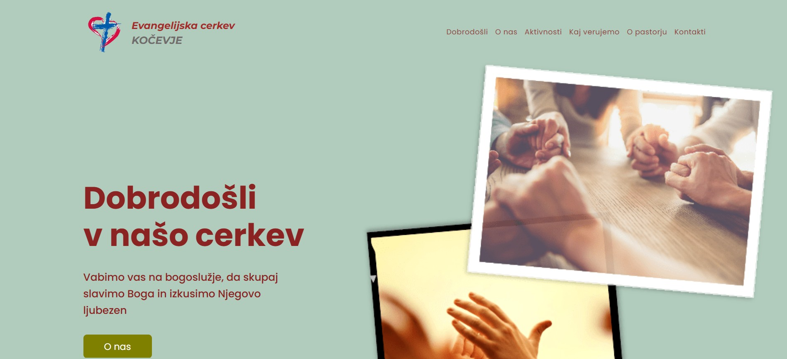
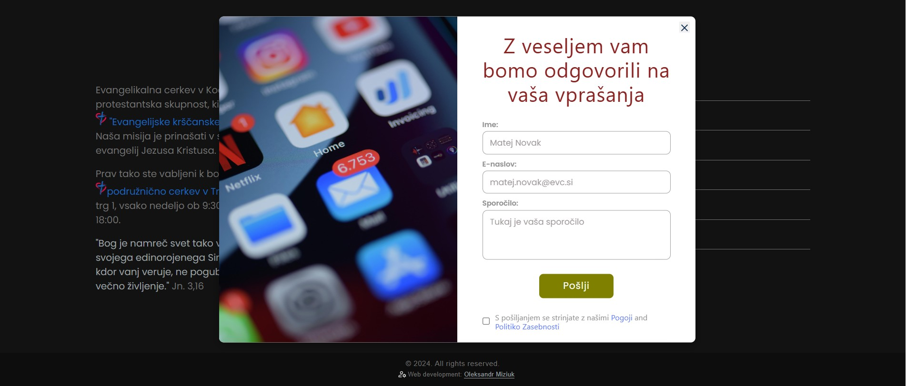

# 🕊 Evangelijska Cerkev Kočevje Website

A modern and responsive website created for the **Evangelical Church in Kočevje (Evangelijska cerkev v Kočevju)**.  
The site presents information about the church, its mission, worship services, and community activities.

---

## 🔧 Technologies Used

**Frontend:**
- HTML5  
- SCSS / CSS3  
- JavaScript (ES6) 

**Backend / Mail Handling:**
- PHPMailer — sending contact form emails

**Build Tools & Optimization:**
- Webpack 5  
- Babel  
- PostCSS + postcss-preset-env  
- Sass Loader  
- HTML Webpack Plugin  
- CSS Loader, Style Loader, MiniCssExtractPlugin  
- Image Webpack Loader  
- CSS Minimizer Plugin  
- Webpack Dev Server  

**Polyfills:**
- @babel/polyfill  

---

## 📍 Client
**Evangelical Christian Church, Kočevje, Slovenia**

---

## 🚀 Features
- Multilingual structure (Slovenian)
- Clean and minimalistic design
- Responsive layout
- Information about worship services and Bible study meetings
- Contact details and location

---

## 📸 Screenshots / Demo
  
  

**Live Demo:** [View Website](https://www.evangelijska-cerkev.si/)

---

## 💻 Local Setup
To run the project locally:

```bash
git clone https://github.com/alexmiziuk/Church-Kochevje.git
cd Church-Kochevje
npm install

```

---

🧰 **Build Modes**

In the **"scripts"** section, several commands are defined for different environments:

| Command | Description |
|----------|--------------|
| **npm run start** | Launches the local development server (webpack server) |
| **npm run build-dev** | Builds the project in development mode (without minification) |
| **npm run build-prod** | Builds the project in production mode (minified and optimized) |
| **npm run clear** | Deletes the **dist** folder before a new build |

---

## 📄 License
MIT License © Oleksandr Miziuk

---

## ✉ Контакты
* **Email:** oleksandr.miziyk@gmail.com
* **GitHub:** [github.com/alexmiziuk](https://github.com/alexmiziuk)